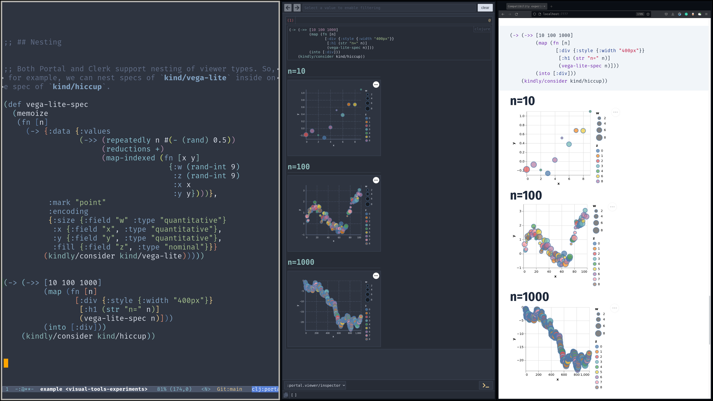

A small experiment in creating a workflow for using visual different tools, such as [Portal](github.com/djblue/portal) (for dynamic exploration) and Clerk (for documentation) through an [nREPL](https://nrepl.org) middleware with a unified notation using an adaptation of [Kindly](https://github.com/scicloj/kindly). The implementation is roughly extracted out of [Notespace](github.com/scicloj/notespace/).

[Walkthrough](https://scicloj.github.io/visual-tools-experiments/portal-clerk-kindly-nrepl-1/public/build/#/src/example.clj) ([source](https://github.com/scicloj/visual-tools-experiments/blob/main/portal-clerk-kindly-nrepl-1/src/example.clj))

[Video](https://www.youtube.com/watch?v=e3M4u1XIVTo)

